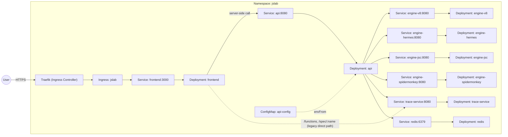
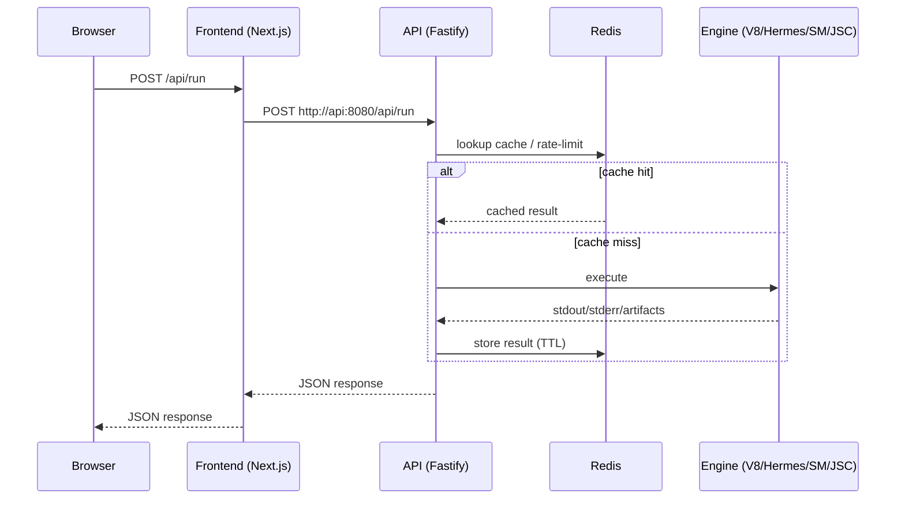

# Infra overview (Docker + Kubernetes)

This document is a quick “map” of the infrastructure: what services (containers) exist, how they communicate, and which Kubernetes resources describe them.

## 1) What runs

| Component | Dockerfile | Kubernetes resources | Port | Dependencies |
| --- | --- | --- | --- | --- |
| `frontend` (Next.js) | `apps/frontend/Dockerfile` | `Deployment/frontend` + `Service/frontend` + `PodDisruptionBudget` | `3000` | `api`, `trace-service` |
| `api` (Fastify gateway) | `apps/api/Dockerfile` | `Deployment/api` + `Service/api` + `ConfigMap/api-config` + `PodDisruptionBudget` | `8080` | `redis`, `engine-v8`, `engine-hermes`, `engine-jsc`, `engine-spidermonkey`, `trace-service` |
| `engine-v8` (d8 wrapper) | `apps/engine-v8/Dockerfile` | `Deployment/engine-v8` + `Service/engine-v8` | `8080` | — |
| `engine-hermes` (`hermes -dump-bytecode` wrapper) | `apps/engine-hermes/Dockerfile` | `Deployment/engine-hermes` + `Service/engine-hermes` | `8080` | — |
| `engine-jsc` (JavaScriptCore wrapper) | `apps/engine-jsc/Dockerfile` | `Deployment/engine-jsc` + `Service/engine-jsc` | `8080` | — |
| `engine-spidermonkey` (SpiderMonkey shell wrapper) | `apps/engine-spidermonkey/Dockerfile` | `Deployment/engine-spidermonkey` + `Service/engine-spidermonkey` | `8080` | — |
| `trace-service` (engine262 abstract-operations tracer) | `apps/trace-service/Dockerfile` | `Deployment/trace-service` + `Service/trace-service` | `8080` | — |
| `redis` (cache / rate limit) | (image) `redis:7-alpine` | `Deployment/redis` + `Service/redis` | `6379` | — |

> **Build context.** `api` and the four `engine-*` images bake in
> `packages/engine-runtime`, so they build from the **repo root**
> (`docker build -f apps/api/Dockerfile .`). `frontend` and `trace-service`
> build from their own directory. Every Dockerfile has a `dev` and a `prod`
> target; Compose and Skaffold use `dev`, CI builds the default target.

## 2) Topology (Kubernetes)



## 3) Request flow for `/api/run`



## 4) Where this lives in the repo

- Base (closest to “prod”): `infra/k8s/base` — full set of resources (Ingress/Middleware/NetworkPolicy/PDB, etc.).
- Prod overlay: `infra/k8s/prod` — base + CI-injected image tags; secrets managed out-of-band.
  Per-service slices live in `infra/k8s/prod/services/<svc>/` so each deploy workflow renders only its own.
- Dev overlay: `infra/k8s/dev` — rewrites `images:` to local Skaffold names and patches manifests for dev (hot-reload, `readOnlyRootFilesystem: false`, probes removed), and excludes both the Traefik CRDs (Ingress/Middleware) and the NetworkPolicies. Use port-forward locally.
- Monitoring overlay: `infra/k8s/monitoring` — Grafana Alloy, **off by default** and referenced by no other kustomization; see `infra/README.md`.
- Dev loop: `skaffold.yaml` — builds 7 images and deploys `infra/k8s/dev` (with port-forward for `frontend` → 3000, `api` → 8080, and `trace-service` → 8085).

For the ingress priorities, the network-policy allowlists, client-IP trust and
node-level disk management, see [`infra/README.md`](../infra/README.md).

## 5) Quick commands

Render (see final YAML, without applying):

```bash
kubectl kustomize infra/k8s/base
kubectl kustomize infra/k8s/dev --load-restrictor=LoadRestrictionsNone
kubectl kustomize infra/k8s/prod
kubectl kustomize infra/k8s/prod/services/api --load-restrictor=LoadRestrictionsNone
```

Dev loop (build + deploy + port-forward):

```bash
skaffold dev --port-forward -n jslab
```

Everything without a cluster:

```bash
docker compose up --build   # from the repo root
```

## 6) Troubleshooting

- Ephemeral debug containers (`kubectl debug`) do not inherit the app container's environment variables; use the main container or pass env explicitly when inspecting secrets.
