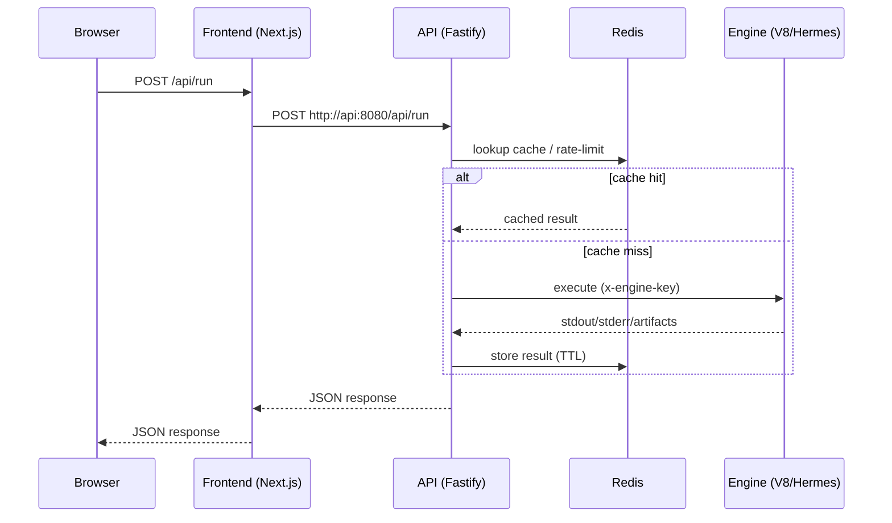

# Infra overview (Docker + Kubernetes)

This document is a quick “map” of the infrastructure: what services (containers) exist, how they communicate, and which Kubernetes resources describe them.

## 1) What runs

| Component | Dockerfile | Kubernetes resources | Port | Dependencies |
| --- | --- | --- | --- | --- |
| `frontend` (Next.js) | `apps/frontend/Dockerfile` | `Deployment/frontend` + `Service/frontend` | `3000` | `api` |
| `api` (Fastify gateway) | `apps/api/Dockerfile` | `Deployment/api` + `Service/api` + `ConfigMap/api-config` + `Secret/api-secrets` | `8080` | `redis`, `engine-v8`, `engine-hermes` |
| `engine-v8` (d8 wrapper) | `apps/engine-v8/Dockerfile` | `Deployment/engine-v8` + `Service/engine-v8` | `8080` | — |
| `engine-hermes` (Hermes toolchain wrapper) | `apps/engine-hermes/Dockerfile` | `Deployment/engine-hermes` + `Service/engine-hermes` | `8080` | — |
| `redis` (cache / rate limit) | (image) `redis:7-alpine` | `Deployment/redis` + `Service/redis` | `6379` | — |

## 2) Topology (Kubernetes)

```mermaid
flowchart LR
  user((User))

  subgraph ns[Namespace: jslab]
    traefik[Traefik (Ingress Controller)]
    ing[Ingress: jslab]

    svc_front[Service: frontend:3000]
    dep_front[Deployment: frontend]

    svc_api[Service: api:8080]
    dep_api[Deployment: api]

    svc_v8[Service: engine-v8:8080]
    dep_v8[Deployment: engine-v8]

    svc_hermes[Service: engine-hermes:8080]
    dep_hermes[Deployment: engine-hermes]

    svc_redis[Service: redis:6379]
    dep_redis[Deployment: redis]

    cm_api[ConfigMap: api-config]
    sec_api[Secret: api-secrets]
  end

  user -->|HTTPS| traefik --> ing --> svc_front --> dep_front
  dep_front -->|server-side call| svc_api --> dep_api
  dep_api --> svc_v8 --> dep_v8
  dep_api --> svc_hermes --> dep_hermes
  dep_api --> svc_redis --> dep_redis

  cm_api -. envFrom .-> dep_api
  sec_api -. secrets .-> dep_api
  sec_api -. secrets .-> dep_v8
  sec_api -. secrets .-> dep_hermes
  sec_api -. secrets .-> dep_front
```

## 3) Request flow for `/api/run`



## 4) Where this lives in the repo

- Base (closest to “prod”): `infra/k8s/base` — full set of resources (Ingress/NetworkPolicy/PDB, etc.).
- Dev overlay: `infra/k8s/dev` — rewrites `images:` to local Skaffold names and patches manifests for dev (hot-reload, `readOnlyRootFilesystem: false`), and excludes Traefik CRDs (Ingress/Middleware).
- Dev loop: `skaffold.yaml` — builds 4 images and deploys `infra/k8s/dev` (with port-forward for `frontend` and `api`).

## 5) Quick commands

Render (see final YAML, without applying):

```bash
kubectl kustomize infra/k8s/base
kubectl kustomize infra/k8s/dev
```

Dev loop (build + deploy + port-forward):

```bash
skaffold dev --port-forward -n jslab
```
